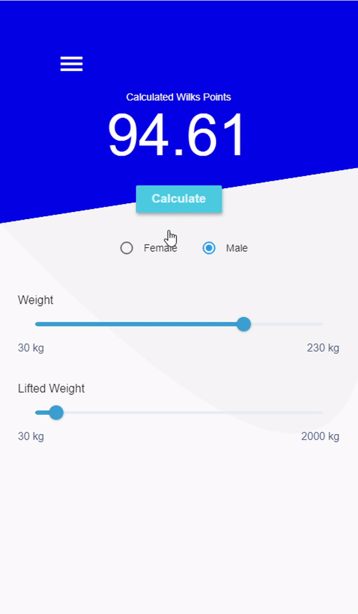

# Fit Calculators

Simple flutter app that allows you to get info about your achievments. Implementation of part of DigiFit that was written in Java in Dart language

It includes some usefull tools for me such as Body Fat percentage calculator, Wilks and IPF Points calculators. 

## Preview

You can use it at : 
https://przemyslawsarnacki.github.io/fit_calculators/

